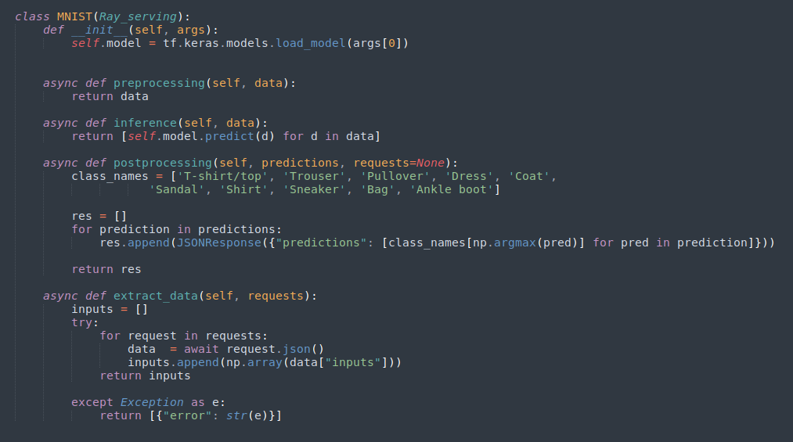
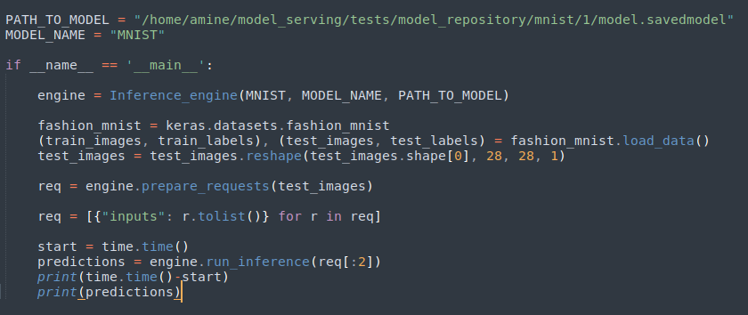
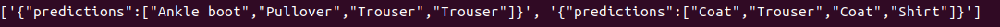

# Tutorial: depoly the MNIST fashion model  using Ray Serve

To serve a model using Ray Serve, we must create a class that inherits from the Ray_serving abstract class. This class must implement the following methods: 

- extract_data(requests): extract inputs from http requests
- preprocessing(data): preprocesses inputs data
- inference(data): make the inference 
- postprocessing(predictions): postprocess the predictions

Let's see an example of that class using the MNIST fashion model:

Once this class is creates, we can deploy it using Ray Serve and make inferences. Below code shows an example using the MNIST class:

Output:

