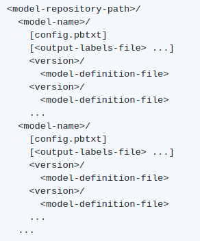

# Model respository

The model repository is folder that contains the different models to serve. It has a special architecture, specified in the [Triton Inference Serve documentation](https://github.com/triton-inference-server/server/blob/main/docs/model_repository.md). 

A global variable **MODEL_REPOSITORY** must be set to the absolute path of the model repository. 

## Model repository archietcture

Each model is reprenseted by a folder Triton will use to deploy. A model folder folder contains two main items: 

* config.pbtxt: a file that must be named **config.pbtxt** and contains the configuration of the model such as the input and output layers of the model, the preferred batch size, etc. To learn more about model configuration, please refer to [Triton Inference Server documentation](https://github.com/triton-inference-server/server/blob/main/docs/model_configuration.md).

* version: a folder wich has as name an integer from 1. It represents the different versions of the models. The oldest one is the version 1. This folder contains the model to deploy (.pb file, .pt file, etc.) 

