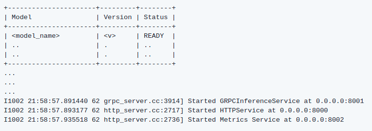

# Model Serving

Serve your Deep Learning models using Triton Inference Server, introduced by NVIDA. 

This project aims to offer a High-Level tool to the user to serve DL models in the one hand and perform inferences through a Python API in the other hand. 

## Start Triton Inferencer Server

$ triton start

## Stop Trtion Inference Server
$ triton stop
## Check if the server is running 

$ triton is_aliveTHE SERVER IS NOT RUNNING
