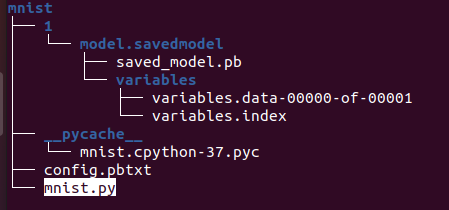
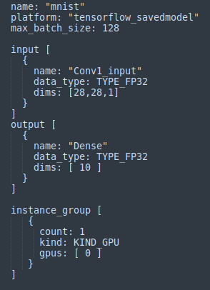
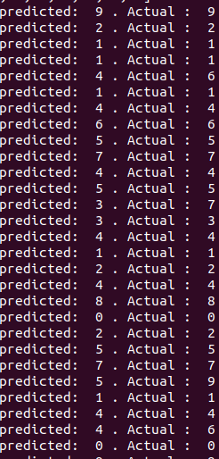

# Tutorial: depoly the MNIST fashion model  using Triton Inference Server

In this tutorial we will deploy the MNIST fashion model build in TensorFlow. Once the model is deployed, we will use the Python API to load data, prepare them and perform inferences. 


First of all, we create a folder named "mnist" that contains our model, as described in the [model repository](http://localhost:8888/notebooks/docs/model_repository.md). 



Inside the folder **1**, we put the model we want to deploy and all the needed files for that model.

The **config.pbtxt** contains the model configuration that we want to use for this model. Please refer to the [model configuration](https://github.com/triton-inference-server/server/blob/main/docs/model_configuration.md) documentation



Second, we create a file in the same folder named "mnist.py", where we will define two methods: preprocessing and postprocessing. 


```python
# mnist.py 

import numpy as np 

def preprocessing(data): 
	return data 

def postprocessing(predictions): 
    class_names = ['T-shirt/top', 'Trouser', 'Pullover', 'Dress', 'Coat',
               'Sandal', 'Shirt', 'Sneaker', 'Bag', 'Ankle boot']
    
    res = [class_names[np.argmax(pred)] for pred in predictions]
    return res 

```

Well, the model is ready to be served. 

Now, we need to setup the Triton Inference Server and run it using the following command: 


```python
! source path_to_project/scripts/env_stack.sh
! triton start
```

Let's verify that the server is running: 


```python
! triton is_alive
```


As the Triton Inference Server is now running and the model is deployed , we can start performing inferences.

Let's create a file that you name as you like. We chose "test_mnist.py"


```python
import sys
import os

sys.path.insert(0, os.getenv("TRITON"))

# we import the python API
from src.triton import utils
from tensorflow import keras


if __name__ == '__main__':
    # We start by getting the FLAGS passed as arguments
	FLAGS = utils.get_flags()
    
    #We create our inference engine based on the received flags  
	infer_engine = utils.setup(FLAGS)

    #We load fashion_mnist dataset from keras
    
	fashion_mnist = keras.datasets.fashion_mnist
	(train_images, train_labels), (test_images, test_labels) = fashion_mnist.load_data()
	test_images = test_images.reshape(test_images.shape[0], 28, 28, 1)

	#We prepare requests tthat will be sent to the server 
    requests = utils.prepare_requests(FLAGS, test_images)
    
    #We sned asynchronously requests to the server
	predictions = utils.async_infer(infer_engine, requests)

	for i in range(len(predictions)):
		print( "predicted: ",  predictions[i] ,". Actual : " , test_labels[i])
```



That's it. Now you are ready to deploy your own model! 
